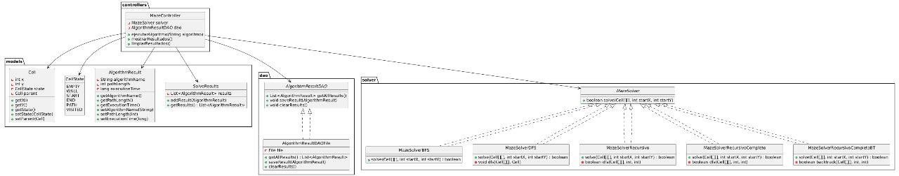
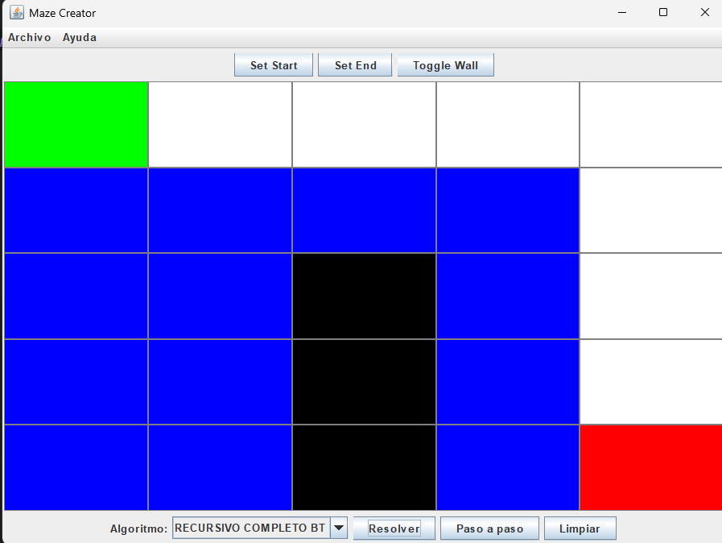
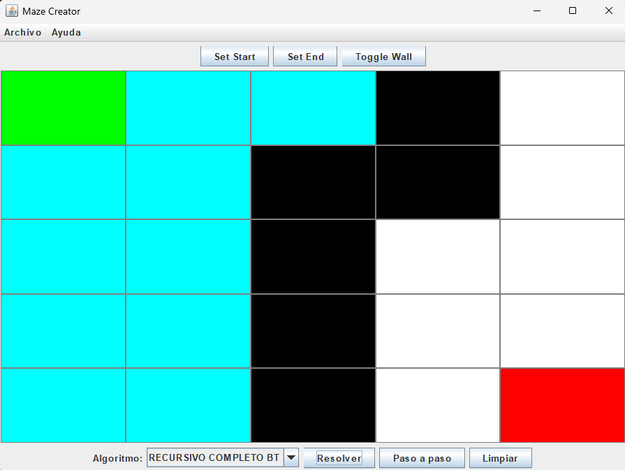

# 📘 Proyecto Final – Estructura de Datos
## 🧭 Resolución de Laberintos con Búsqueda y Optimización

---

### 📌 Universidad Politécnica Salesiana

**Materia:** Estructura de Datos  
**Docente:** Pablo Torres

**Estudiantes:**
- **Elkin Jair Chamba Maura** – echambam@est.ups.edu.ec
- **Sebastián Rafael Cerón Miranda** – sceronm@est.ups.edu.ec
- **Mateo Sebastián Morjeon Delgado** – mmorejond@est.ups.edu.ec

**Fecha:** 29 de julio de 2025

---

## 1. 🧩 Descripción del Problema

El presente proyecto tiene como objetivo resolver un laberinto representado mediante una matriz de celdas transitables (`1`) y no transitables (`0`). Se debe encontrar una ruta válida desde un punto de inicio hasta un punto de destino, utilizando estructuras de datos eficientes y algoritmos de búsqueda, retroceso y optimización. Se evaluará el rendimiento y comportamiento de cada técnica empleada.

---

## 2. 🧪 Propuesta de Solución


### 📚 Marco Teórico

Se implementaron cinco algoritmos para la resolución de laberintos, cada uno con distintas características y enfoques:

- **Recursivo 2D:** Recorre el laberinto explorando solo hacia la derecha y hacia abajo.
- **Recursivo 4D:** Permite exploración completa en las 4 direcciones (arriba, abajo, izquierda, derecha).
- **Recursivo con Backtracking:** Registra las celdas visitadas y retrocede cuando encuentra caminos sin salida.
- **DFS (Depth-First Search):** Utiliza una pila (o la recursión) para profundizar en los caminos hasta llegar al objetivo o retroceder.
- **BFS (Breadth-First Search):** Utiliza una cola para recorrer el laberinto por niveles, garantizando encontrar el camino más corto.

Cada algoritmo se implementa sobre una estructura de matriz que utiliza objetos `Cell`, permitiendo verificar si una celda es transitable, ya fue visitada, o pertenece al camino correcto.

---

### 🧰 Tecnologías Utilizadas

- **Lenguaje de programación:** Java
- **IDE sugerido:** IntelliJ IDEA / NetBeans / Eclipse
- **Interfaz gráfica:** Swing
- **Gráficos estadísticos:** JFreeChart
- **Persistencia de resultados:** Archivos CSV mediante patrón DAO (Data Access Object)

---

### 📊 Diagrama UML



## 🧷 Diagrama UML – Explicación

El diagrama UML presentado modela la arquitectura del proyecto de resolución de laberintos, organizado en paquetes lógicos para representar las responsabilidades de cada componente.

### 📦 1. models
Contiene las clases base que representan la estructura del laberinto y los resultados.

- **`Cell`**: Representa una celda del laberinto con coordenadas, estado (`CellState`) y referencia al padre para reconstruir caminos.
- **`CellState`**: Enum que define los estados posibles de una celda: vacía, pared, inicio, fin, camino o visitada.
- **`AlgorithmResult`**: Almacena resultados de ejecución (nombre del algoritmo, longitud del camino, tiempo).
- **`SolveResults`**: Agrupa múltiples resultados de diferentes algoritmos.

### 📦 2. dao
Define la interfaz para la persistencia de resultados y su implementación concreta.

- **`AlgorithmResultDAO`**: Interfaz con métodos para obtener, guardar y limpiar resultados.
- **`AlgorithmResultDAOFile`**: Implementa la persistencia usando archivos.

### 📦 3. solver
Contiene la interfaz base de algoritmos y sus implementaciones concretas.

- **`MazeSolver`**: Interfaz que declara el método `solve(...)`.
- Implementaciones:
    - **`MazeSolverBFS`**: Búsqueda por anchura.
    - **`MazeSolverDFS`**: Búsqueda en profundidad.
    - **`MazeSolverRecursivo`**, **`MazeSolverRecursivoCompleto`**, **`MazeSolverRecursivoCompletoBT`**: Variantes recursivas con diferentes niveles de exploración y retroceso.

### 📦 4. controllers
Gestiona la lógica general y coordinación.

- **`MazeController`**: Controla la matriz, modos de edición, ejecución de algoritmos y manejo de resultados.

### 📌 Relaciones destacadas
- `MazeController` utiliza algoritmos (`MazeSolver`), clases modelo (`Cell`, `CellState`, etc.) y persistencia (`AlgorithmResultDAO`).
- Herencia: implementaciones concretas extienden las interfaces (`MazeSolver`, `AlgorithmResultDAO`).

### 🧩 Propósito
Este diagrama refleja la separación de responsabilidades, modularidad y facilidad para extender el proyecto con nuevos algoritmos o formas de persistencia.

---

### 🖼️ Interfaz Gráfica

A continuación, se presentan capturas de dos laberintos diferentes utilizando un algoritmo de resolución (por ejemplo, BFS):

**Laberinto 1 – Camino encontrado:**  


**Laberinto 2 – Sin solución:**


---

### 💻 Código Ejemplo – Clase `MazeController.java`

Este controlador se encarga de manejar la lógica principal del laberinto: selección de celdas, registro de algoritmos, ejecución, y persistencia de resultados. Utiliza un patrón de diseño orientado a eventos y separación de responsabilidades.

```java
package controllers;

import dao.AlgorithmResultDAO;
import models.AlgorithmResult;
import models.Cell;
import models.CellState;
import models.SolveResults;
import solver.MazeSolver;

import java.util.*;

public class MazeController {

    // Enum para modo de edición de celda: inicio, fin o pared
    public enum Mode {
        START, END, WALL
    }

    private Mode modoActual = Mode.WALL; // Modo actual seleccionado por el usuario
    private Cell[][] matriz;             // Matriz del laberinto
    private Cell startCell;              // Celda de inicio
    private Cell endCell;                // Celda de fin

    private final Map<String, MazeSolver> algoritmos = new LinkedHashMap<>(); // Algoritmos registrados
    private final AlgorithmResultDAO resultDAO; // Objeto para persistir resultados

    // Constructor
    public MazeController(AlgorithmResultDAO resultDAO) {
        this.resultDAO = resultDAO;
    }

    // Establece el modo actual (inicio, fin o pared)
    public void setMode(Mode modo) {
        this.modoActual = modo;
    }

    public Mode getMode() {
        return modoActual;
    }

    // Establece la matriz de celdas
    public void setMatriz(Cell[][] matriz) {
        this.matriz = matriz;
    }

    // Devuelve la matriz como booleanos (true si transitable)
    public boolean[][] getMatriz() {
        boolean[][] m = new boolean[matriz.length][matriz[0].length];
        for (int i = 0; i < matriz.length; i++) {
            for (int j = 0; j < matriz[0].length; j++) {
                m[i][j] = matriz[i][j].getState() != CellState.WALL;
            }
        }
        return m;
    }

    public Cell getStartCell() {
        return startCell;
    }

    public Cell getEndCell() {
        return endCell;
    }

    // Acción cuando el usuario hace clic en una celda
    public void onCellClicked(int fila, int columna) {
        Cell cell = matriz[fila][columna];
        switch (modoActual) {
            case START -> {
                if (startCell != null) {
                    matriz[startCell.getRow()][startCell.getCol()].setState(CellState.EMPTY);
                }
                cell.setState(CellState.START);
                startCell = cell;
            }
            case END -> {
                if (endCell != null) {
                    matriz[endCell.getRow()][endCell.getCol()].setState(CellState.EMPTY);
                }
                cell.setState(CellState.END);
                endCell = cell;
            }
            case WALL -> {
                if (cell.getState() == CellState.WALL) {
                    cell.setState(CellState.EMPTY);
                } else {
                    cell.setState(CellState.WALL);
                }
            }
        }
    }

    // Registra un algoritmo para ser usado en la resolución
    public void registrarAlgoritmo(String nombre, MazeSolver solver) {
        algoritmos.put(nombre, solver);
    }

    // Ejecuta el algoritmo seleccionado, mide el tiempo y guarda el resultado
    public SolveResults ejecutar(String nombreAlgoritmo, boolean[][] grid, Cell inicio, Cell fin) {
        MazeSolver solver = algoritmos.get(nombreAlgoritmo);
        if (solver == null) {
            throw new IllegalArgumentException("Algoritmo no registrado: " + nombreAlgoritmo);
        }

        long t0 = System.nanoTime(); // Inicio del cronómetro
        SolveResults resultado = solver.getPath(convertToCells(grid), inicio, fin);
        long tf = System.nanoTime(); // Fin del cronómetro
        long duracionNs = tf - t0;

        // Guarda en la base de datos (CSV)
        resultDAO.guardarResultado(new AlgorithmResult(nombreAlgoritmo, resultado.getPath().size(), duracionNs));

        return resultado;
    }

    // Lista todos los resultados registrados
    public List<AlgorithmResult> listarResultados() {
        return resultDAO.obtenerResultados();
    }

    // Limpia el historial de resultados
    public void limpiarResultados() {
        resultDAO.limpiarResultados();
    }

    // Devuelve los nombres de los algoritmos disponibles
    public Set<String> obtenerNombresAlgoritmos() {
        return algoritmos.keySet();
    }

    // Convierte la matriz de booleanos a matriz de celdas con estados
    private Cell[][] convertToCells(boolean[][] grid) {
        int filas = grid.length;
        int cols = grid[0].length;
        Cell[][] cells = new Cell[filas][cols];
        for (int i = 0; i < filas; i++) {
            for (int j = 0; j < cols; j++) {
                cells[i][j] = new Cell(i, j);
                cells[i][j].setState(grid[i][j] ? CellState.EMPTY : CellState.WALL);
            }
        }
        return cells;
    }
}
```

---
## 3. ✅ Conclusiones

- La implementación de múltiples algoritmos permite comparar estrategias de resolución de laberintos según su complejidad, eficiencia y resultados.
- El algoritmo **BFS (Breadth-First Search)** garantiza encontrar el camino más corto, siendo ideal para rutas óptimas.
- El proyecto implementa varios algoritmos para resolver laberintos, comparando su eficiencia en términos de tiempo y precisión. Usando estructuras de datos eficientes y herramientas como **Swing** y **JFreeChart**, se logra una interfaz interactiva y una visualización clara de resultados. La persistencia de datos mediante **DAO** y **CSV** permite gestionar y almacenar resultados de manera efectiva, con oportunidades para futuras mejoras, como la optimización con heurísticas.(Mateo Morejon)
- El recorrido del laberinto no se mostraba correctamente porque el camino se construía de fin a inicio. Al no aplicar Collections.reverse(), el orden estaba invertido. Agregar esta instrucción permitió visualizar el recorrido correctamente desde la celda de inicio hasta la de fin. (Sebastian Ceron)

---

## 4. 💡 Recomendaciones y Aplicaciones Futuras

- **Optimización con heurísticas:** Incorporar algoritmos como **A\*** o **Dijkstra**, que permiten encontrar caminos óptimos considerando costos o distancias.
- **Generación aleatoria de laberintos:** Añadir una función para generar laberintos automáticos con distintos niveles de dificultad.
- **Exportación de estadísticas:** Permitir la creación de informes en formatos como **PDF** o **Excel**, con datos detallados sobre cada ejecución.
- **Soporte multiplataforma:** Migrar el proyecto a una versión **web** o móvil, ampliando su accesibilidad y alcance educativo o comercial.

